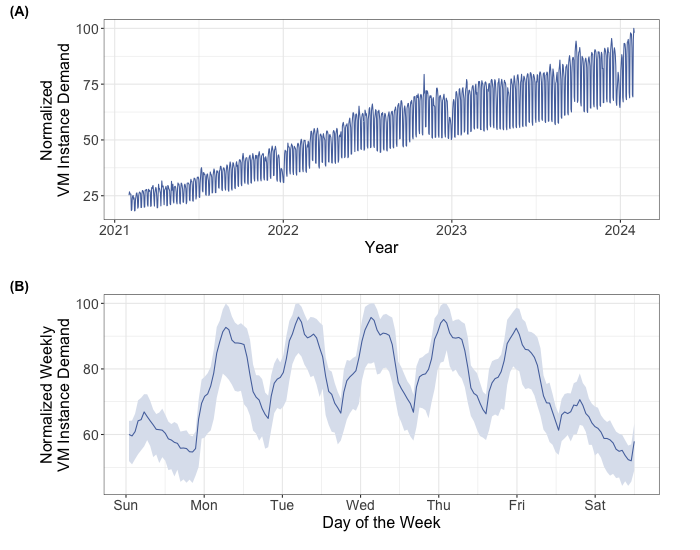
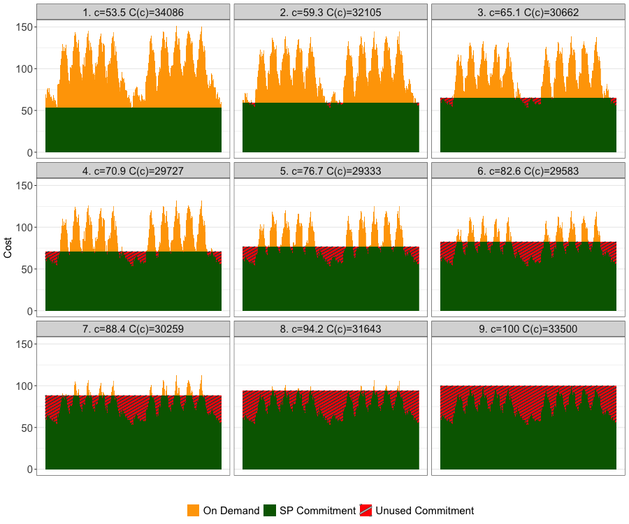
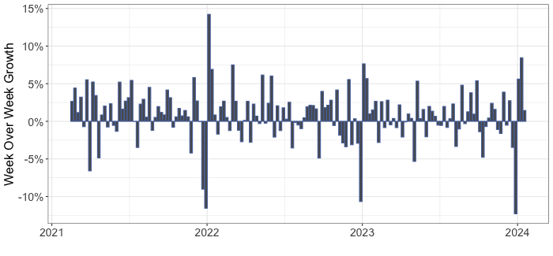
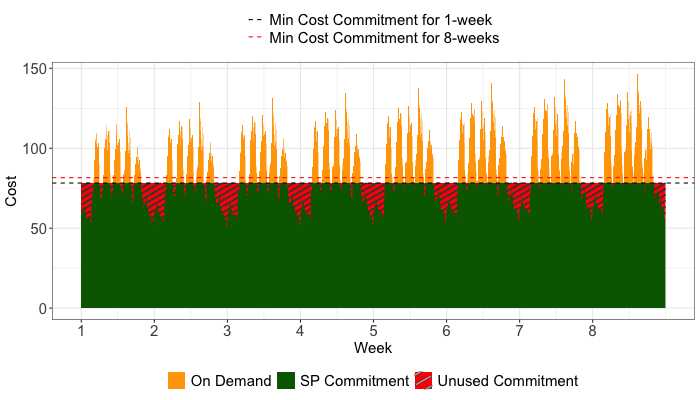
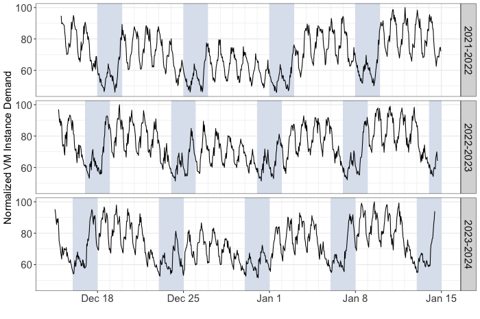
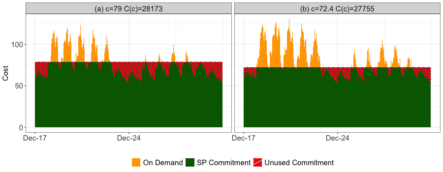
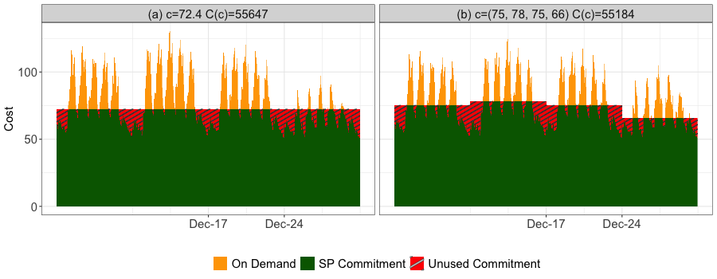

# Snowflake Cyclic VM Demand Dataset

This directory contains code and images for the figures in our
[ICPE 2025](https://icpe2025.spec.org/) paper, "Shaved Ice: Optimal Compute Resource Commitments for
Dynamic Multi-Cloud Workloads".

[](https://doi.org/10.5281/zenodo.15015992)

This project is archived on [Zenodo](https://zenodo.org/), an open-access repository, to ensure long-term reproducibility of the research.

## Index of Figures

| Figure | Description                                  | Image Filename    | Source File                          | Image                                    |
|--------|----------------------------------------------|-------------------|--------------------------------------|------------------------------------------|
| 2      | VM Demand Timeseries                         | dailypattern.pdf  | [timeseries.Rmd](timeseries.Rmd)     |   |
| 4      | 3x3 Grid Showing Numeric Optimization Method | 3x3.pdf           | [optimization.Rmd](optimization.Rmd) |            |
| 5      | Week over week growth timeseries             | wowgrowth.pdf     | [trend.Rmd](trend.Rmd)               |      |
| 6      | 8-week extrapolation timeseries              | trendforecast.pdf | [trend.Rmd](trend.Rmd)               |  |
| 7      | Hourly holiday VM demand timeseries          | annualholiday.pdf | [timeseries.Rmd](timeseries.Rmd)     |  |
| 8      | 1 vs 2 week forecast horizon comparison | forecastw12.pdf | [optimization.Rmd](optimization.Rmd) |  |
| 9      | 4 week laddered expiration example | ladderedholidayex.pdf | [trend.Rmd](trend.Rmd)               |  |

## Contact

Murray Stokely (murray.stokely@snowflake.com)

## Usage

Copyright 2025 Snowflake Inc. This data is licensed under CC BY 4.0.
To view a copy of this license, visit https://creativecommons.org/licenses/by/4.0/

Kindly cite the following publication if you are using our dataset:

```
@inproceedings {snowflake-icpe25,
  author = {Murray Stokely and Neel Nadgir and Jack Peele and Orestis Kostakis},
  title = {Shaved Ice: Optimal Compute Resource Commitments for Dynamic Multi-Cloud Workloads},
  booktitle = {Proceedings of the 16th ACM/SPEC International Conference on Performance Engineering (ICPE '25)},
  year = {2025},
  publisher = {Association for Computing Machinery},
  address = {New York, NY, USA},
  url = {https://doi.org/10.1145/3676151.3719353},
  doi = {10.1145/3676151.3719353}
}
```